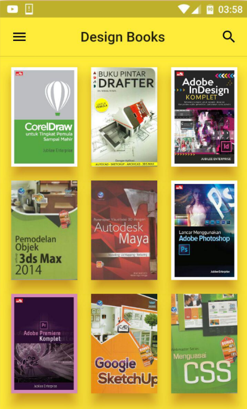
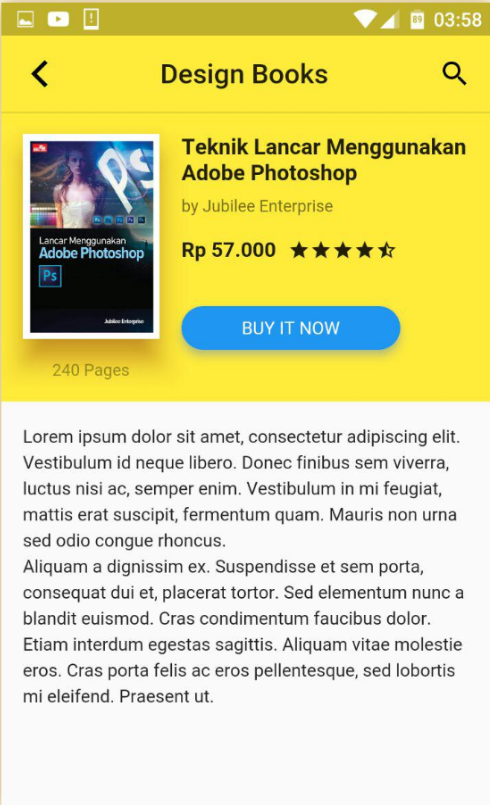

# 📚 Flutter Book UI App

A clean and modern **Book Listing & Details UI** built using **Flutter**.  
This project focuses on UI design and layout best practices for **Android and iOS** platforms.

## ✨ Features

- Beautiful grid layout for displaying books
- Smooth navigation to detailed book view
- Clean and minimal UI design
- Fully responsive layout
- Supports both Android and iOS devices

## 📱 Screens Included

- **Home Screen:** Displays book covers in a grid format
- **Book Detail Screen:** Shows book title, price, ratings, pages & description

## 🛠️ Tech Stack

| Technology | Purpose |
|-----------|---------|
| Flutter | Cross-platform UI development |
| Dart | Core programming language |
| Material Design Widgets | UI Components |

## 🧩 UI Preview

| Home Screen | Details Screen |
|------------|----------------|
|  |  |

*(Add your own screenshots in `art/` folder if needed)*

## 🚀 How to Run

```bash
flutter pub get
flutter run

